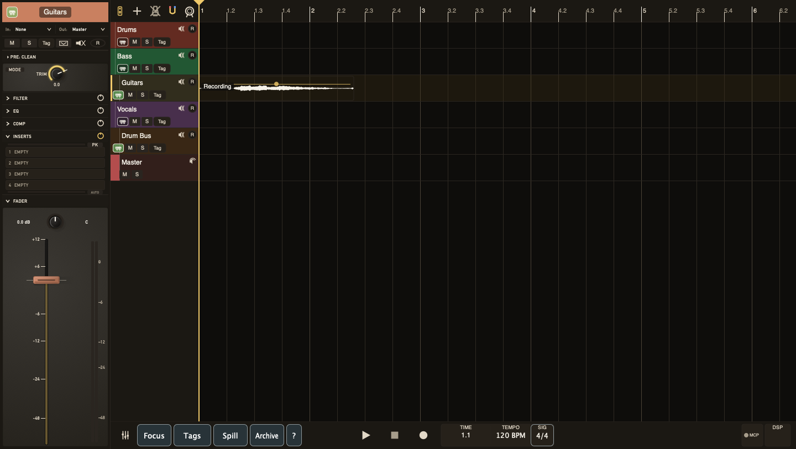

# The Timeline

The timeline is where you record, edit, navigate, and arrange the reel.

## Layout

The top ruler shows time or bars/beats. The tape head marks the current play position. Tracks run vertically down the left, with clips arranged on lanes to the right.

The arranger and transport have no right endpoint. You can seek, scroll, edit, record, or keep playing beyond the last clip; playback continues through silence until you press Stop or Pause. The horizontal scrollbar expands its working canvas as you move further right and is not an end-of-reel marker. The Tape Length selected for Tape Mode clamps only the reel and ribbon graphic, not the timeline or playback.

The transport position follows that ruler format. Its larger lower line shows the current time or bar and beat. Click the readout to toggle between the single display and a two-line display with the alternate value above it; TayPE remembers that choice globally. Double-click the larger value to type a new position in the format shown, then press Return to seek there. Escape or clicking away cancels the entry.

The selected track drives the docked channel strip, hardware-control focus, and many keyboard operations. TayPE keeps that selection visible when you change view, scale, or strip width.

## Ruler Header Controls

The ruler header includes controls for follow-playhead behaviour, mixer width, track creation, archive view, and other view tools. Follow keeps the playhead visible during playback without yanking your edit focus while you are making a deliberate selection or drag.

## Track States

A track can be current, focused, muted, soloed, record-armed, monitored, archived, or part of a bus/comp group. TayPE uses these states to keep busy reels readable: focus narrows attention, archive hides finished material, and grouped controls let selected tracks move together without flattening their relative balances.

## Editing Model

Most edits are non-destructive. Moving, splitting, trimming, fading, archiving, and disabling clips change the reel state without rewriting the original media. Splitting clips adds the current default fade at the new cut edges. Use checkpoints when you want a named recovery point before a bigger move.

## Printing wet stems with JD's Law

In the Print Mix, Print Loop, or Print Marker Ranges export window, select
**Stems**, choose the tracks or buses you want, then enable **JD's Law**. TayPE
prints each selected stem through its downstream buses and the master, one at
a time. This includes the downstream mix processing rather than only the
direct post-fader stem.
Tracks used only as sidechain keys still drive the selected stem's effects;
their audio does not enter that stem directly.

In **Choose Stems**, **Select All Shown** selects every target in the current
filter. Once all shown targets are selected, the button becomes **Deselect All
Shown**. Changing filters does not clear selections hidden by the new filter.

The export window hides any visible plug-in windows before it opens. When it
closes, TayPE restores those plug-in windows in their previous order. Plug-ins
that were already hidden with Option+P remain hidden.

Muted targets remain muted. If **Master** is also selected, TayPE prints the
ordinary full mix once and then prints the wet stems. Live mode plays every
pass in real time; Offline mode performs the same sequence without sending it
to the speakers. Any solo state that existed before printing is restored when
the operation finishes or is cancelled.

While JD's Law is printing, the banner shows **Master** for the optional
master pass, then the name of each track or bus as its wet stem is printed.
The mixer shows each pass's temporary solo state. Participating tracks can
show meter activity while the pass is rendering, including offline renders.

Each Offline pass saves a readable `.render-report.txt` and
shows a summary in TayPE. The report distinguishes recovered plug-in waits
from missed plug-in blocks, automation delivery failures and incomplete files.
After selected-format conversion, the in-app report lists the result for each
output file in the batch; each saved sidecar describes its own pass.
A stem print's `stems` folder holds only the stems and The Mule, so you can
drag them out of Finder in one go; their reports are in its `reports` folder.
A recovered wait does not stop the print. Recoverable misses are reported and
rendering continues. If one master or stem file cannot be completed, other
files and later offline passes continue where the render graph remains usable.
An offline marker range with an invalid range or unavailable output path is
reported and skipped; later ranges are still attempted. A JD's Law target
whose isolation cannot be established is likewise skipped if its temporary
processing state was restored safely. TayPE stops when it cannot establish a
trustworthy render graph, including a refused PDC rebuild.
If offline NAM Quality cannot be prepared but the original graph is fully
restored, the print continues at its original NAM quality and reports that
change. A failed graph restoration still stops later passes, but TayPE converts
any already completed WAVs to the selected formats without deleting those WAVs.
The print remains marked failed; conversion does not conceal the restoration
problem.
If automation scheduling stops, the print still runs to completion: controls
hold their last delivered value, or their stored static value if no update was
delivered. The report identifies the affected portion; check it before using
the audio as an accurate automated mix.
TayPE keeps every WAV written so far, including incomplete audio. Only complete
WAVs are converted to selected formats; failure in one conversion does not
skip the others. AAC and MP3 conversion wait for their encoders to exit rather
than stopping at a fixed time limit. Check the report before using a file
marked incomplete or completed with issues. In a multi-pass print, the report
window shows the outcome of the whole export: one failed pass followed by a
complete pass reads "Completed with issues", with the failed pass detailed in
the report. If a compressed-only export
succeeds, TayPE keeps the selected format and removes its intermediate WAV as
usual. A report-write failure is shown in TayPE and the Session Log. The
sidecar identifies the pre-conversion WAV and appends the final selected-format
files and whether the WAV was retained or removed.

Live export failures also keep any WAV audio already written, including
incomplete master or stem files. TayPE identifies those files in the failure
message; check them before use. Internal bounces are not exports and do not
retain failed scratch audio.

In Live mode each pass starts only once the previous pass has fully stopped.
If a live pass or marker range cannot start, for example because playback is
refused or the audio device stops delivering audio, TayPE names it and the
reason in the report and carries on with the next one.

## Printing reconciled stems with Seldon's Law

**Seldon's Law** prints wet stems that add back up to your master. Each stem
keeps the master's sound as it would have treated that stem within the whole
mix, so you do not need to build the mix around stem delivery.

In the Print Mix, Print Loop, or Print Marker Ranges export window, select
**Stems** and **Offline**, then enable **Seldon's Law**. JD's Law and Seldon's
Law cannot both be on: choosing one turns the other off, and choosing **Live**
turns Seldon's Law off.

You do not choose the stems. Seldon's Law takes every track or group that
feeds the master, following the actual outputs and sends. Shared effects
returns are heard in each stem that feeds them rather than printed as stems of
their own. **Choose Stems** shows the stems Seldon's Law will print but cannot
change them; your own stem selection is kept for when Seldon's Law is off. If a
bus is both a group and a send return, or a return inside a group is fed from
outside it, the export window names the channels and Export stays unavailable
until the routing gives every sound one owner.

TayPE prints the full master first, then each stem through its downstream
buses and the master, all at full floating-point precision. With **Print
tails** on, every stem runs to exactly the master's length. When every pass is
done, TayPE restores your solo state and reconciles the stems while the banner
shows **Seldon's Law — reconciling stems**; press Stop to cancel.

The stems folder then contains:

- each corrected stem, named like an ordinary stem;
- `…-themule.wav`, holding any sound no stem owns (normally silence);
- an `uncorrelated` folder holding each original wet render, with
  `-uncorrelated` before `.wav`, kept as a 32-bit float WAV for comparison;
- a `reports` folder holding each pass's render report.

The corrected stems, The Mule and, when **Master** is selected, the master are
delivered as 24-bit WAVs and converted to any formats you selected. The
`-uncorrelated` files are never converted or removed. Together, the corrected
stems and The Mule add back to the master; the Session Log records how closely.
If a capture or the reconciliation fails, TayPE reports it, keeps the captured
audio and does not present the stems as reconciled.

## Offline plugin oversampling

Select **Offline** in the Print Mix, Print Loop or Print Marker Ranges export
window to show **use 4x plugin oversampling**. This optional setting processes
each uninterrupted audio-effect plugin section at 192 kHz, then returns its
audio to TayPE’s 48 kHz engine. It also applies to offline stems and JD’s Law
passes. MIDI-capable audio effects are included; instruments, hardware handling
and ToTaype’s built-in processing remain unchanged. The output file’s sample
rate does not change.

TayPE remembers this choice globally, including when you cancel the dialog.
The checkbox is hidden in Live mode. It has no effect on realtime prints,
playback or tracking. Oversampling can reduce aliasing from nonlinear plugins;
its extra processing cost applies only while printing offline.

## Plugin oversampling for bounce

**Preferences → General → use 4x plugin oversampling for bounce** enables
192 kHz processing around each uninterrupted audio-effect plugin section
during **Bounce Clips to Stem** and **Bounce Tracks to Stem**. It uses the
same 4x plugin oversampling as offline Print; the bounced file stays at 48 kHz.

The choice is saved globally, separately from the Print dialog setting, and
defaults to off. It does not affect synth rendering, comp flatten, Bounce
External, playback or tracking.

## Related Timeline Workflows

* [Automation](automation.md): show, edit, and capture volume, pan, or width moves.
* [Varispeed](varispeed.md): rehearse or record at a different playback speed while preserving pitch.
* [Video Reference](video-reference.md): keep one picture reference in sync with the reel for scoring work.
