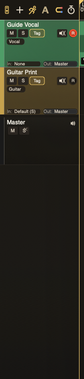

# Track Headers

Track headers hold the controls you need before reaching for the mixer.

## Controls

* **Name**: double-click to rename.
* **Mute / Solo**: silence or isolate tracks. Muting a bus also silences
  the sends of every track that goes into it, directly or through other
  buses.
* **Tag**: apply and filter by track tags.
* **Archive**: move a finished track out of the main working set.
* **MON**: monitor input or instrument output. When live MIDI preview is
  sounding through the instrument, this lamp turns orange: constantly while a
  VSTi window is open, or only while the playhead is inside the clip if just
  the MIDI editor is open. Opening those windows does not turn monitoring on;
  with MON off, clip audio keeps playing. On a bus, MON off drops what
  other tracks route or send into it and silences their sends, while the
  bus's own clips keep playing. A comping bus passes its takes whatever
  its MON.
* **Record**: arm the track for audio recording. Hidden in Automation View,
  because automation capture does not use record-arm. Mixer Record stays.
* **Input / Output**: choose routing. **Off** is the last output choice: the
  track and its sends aren't heard anywhere, but it can still key a sidechain
  and stays live (it can be armed, soloed and printed from as usual). A track
  that goes into a bus set to Off isn't heard either.
* **Bus**: turn a track into a bus or comp group where supported.

The follow-playhead control lives in the timeline header toolbar, not inside each track header. It keeps playback visible while leaving selected-track focus alone.

## Multi-output instruments

When an instrument exposes auxiliary mono or stereo outputs, ordinary audio tracks
show an **Instrument Outputs** section in the Input menu. Open the source-track
submenu, then choose an output to feed it into the
destination before its trim, preamp, EQ, compressor, inserts, fader, and sends.
Turn on **MON** to hear the route, or arm the destination to record it.
Mono outputs feed the same signal to the destination's left and right channels.

Each output is listed by its channel numbers, the name the plug-in gives it and
its width, for example **Output 3: Kick (Mono)** or **Output 13/14: Overhead
(Stereo)**. The name is the plug-in's own label for that output, the one its
routing page uses; it does not change when you route different sounds to the
output inside the plug-in. The track's input label shows the source track and
the output, such as **AD2 — Output 3: Kick (Mono)**. When the output cannot carry
audio, the label reads **Unavailable** with the reason, for example when the
source track no longer has its instrument.

The instrument's first stereo output always remains on its own track. Assigned
auxiliary outputs stop being discarded; unassigned outputs remain silent. If a
saved output is unavailable, TayPE keeps the assignment and reports it instead
of substituting another output.

## Selection

Click a header to select the track. Cmd-click toggles tracks into the visible selection. Shift-click extends a range. The first selected track remains the primary track for the docked strip and focused hardware control.

## Reordering

Drag unused space in a track header vertically to move the track. The insertion
line shows where it will land.

A comp group stays intact while you reorder it. Dragging the comp bus moves the
bus and every child take track together, in their existing order. When the group
is collapsed, its single visible row still represents that complete block.
Individual child tracks can be rearranged inside their own comp group, but
cannot be dragged outside it or through another group's boundary.

When exactly one ordinary or comping bus is selected, **Add Audio Track**
creates the new track inside that bus. Ordinary buses receive it as a routed
input. Comping buses receive a new child take track with the bus input and an
incremental name such as `Lead Vocal - 1`. If a comp child is selected, the
new track becomes its sibling inside the same comp group and is inserted
immediately after it. Multi-selection disables this automatic parenting.

**Duplicate Track** (Option+D) on a comp bus copies the whole group: the bus
and every child take, including clips, as a new group immediately after the
original. **Duplicate Track Without Content** (Cmd+D) copies only the comp
bus itself and parks that empty copy after the original group. The original
takes stay with the original bus. Duplicating a child take still copies that
one take inside the same group.

Cmd-click the blue Bus control on a non-empty comping bus when you are ready
to leave comp mode. A required confirmation warns that all Cuts will be
flattened and the shared child take tracks removed. If you continue, TayPE
renders the audible comp offline in every Cut, placing a separate flattened
clip in each Cut that has comp material before turning the former bus into a
normal audio track. Enabled loop braces do not repeat or shorten the flatten.
The whole operation is one undo step; if any Cut cannot be rendered, the comp
group and every Cut remain unchanged.

The flattened audio includes the child tracks' channel-strip settings because
those tracks feed the comp bus. It is captured before the comp bus's own
channel strip. The former bus keeps that strip live, so its trim, processing,
inserts, width, pan, and fader are not baked into the clip or applied twice.

Turn on **Grouped Track Controls** from the Tracks menu, with **Cmd+G**, or
from the **GRP** transport indicator to control a selection together. Clicking
Mute, Solo, MON, or Record on a selected arranger header then applies the
clicked track's new state to every compatible selected track. Turn grouped
controls off to change only the clicked track. Input routing stays
primary-track only.

## Tag Cloud

The Tag popup lets you add labels such as `Vocal`, `Guitar`, `Print`, or your own categories. Tags help with filtering, selection, and keeping large reels sane.

## Archive View

Archived tracks are kept with the reel but hidden from the main working surface until Archive View is enabled. Use archive for printed stems, safety tracks, old takes, and anything you want preserved without cluttering the current pass.

An archived track is out of the mix completely. It never plays, in playback or in any print, stem, bounce or comp flatten. It never keys a compressor or plug-in sidechain, its solo and mute never affect other tracks, it adds no latency and its plug-ins are unloaded. Archived tracks don't count towards the 256-track limit, and their clips don't make the reel, a print or a new marker range longer.

Archiving keeps everything about the track: its fader, mute, solo, routing, sends, plug-ins and their settings, sidechain links and clips all come back exactly as they were when you unarchive it. Its plug-ins are unloaded while it is archived and load again in the background when you unarchive it; until they have loaded, Undo and Redo ask you to wait for them.

While a track is archived, TayPE won't let it do anything. Recording or arming it, editing or re-rendering its MIDI, bouncing its clips, flattening an archived comping bus, splitting its stems, opening its clips in Melodyne, changing its bus or comp mode, or adding a track under an archived bus all show a "Please unarchive to ..." message. You can still tidy it up: remove or disable plug-ins, and move or edit its clips in Archive View.

Archiving a bus doesn't archive the tracks routed into it. Those tracks stay in the main view, but they go silent: nothing reaches the archived bus, nothing falls back to the master, and their sends are silent too. They can still key a sidechain. A track that isn't heard like this, or whose output is Off, isn't offered as a stem and can't be bounced; TayPE tells you which track when you try. Archived tracks and buses are never offered as a sidechain source, output or send. If a track was already sending or keying from one, the selector still shows it, marked as archived (for example "Kick (archived)"), and it stays silent until you unarchive.

When you flatten a comping bus, archived takes are left out of the flattened audio and kept.

Double-clicking a MIDI clip on an archived track opens the MIDI editor to look at it only. Its editing tools and **Commit** are switched off, and the editor says "Please unarchive to edit MIDI." until you unarchive the track. Edits you hadn't committed before archiving are kept, and you can still discard them.

Unarchiving can be refused if the reel already has 256 live tracks. Archived tracks never stop another track from using a hardware output or a hardware insert's inputs and outputs. If another track has taken the inputs or outputs of a hardware insert while its track was archived, unarchiving switches that hardware insert off and tells you so; if another track has taken the hardware output the archived track used, unarchiving sets its output to **Off** and tells you so, and you pick a new output. Either way the other track keeps them. Missing audio files and NAM models on archived tracks are still reported when you open the reel.
