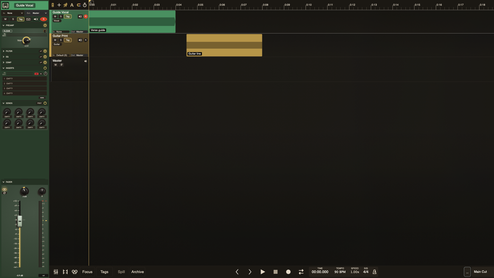

# Channel Strip

Every track in TayPE has a built-in channel strip. The signal flows through each stage in order:

**Input → Trim → Preamp → Filters → EQ → Compressor → Inserts → Fader → Pan → Output**

Each section can be enabled or bypassed independently. The on/off state does not control whether the body is open: if you leave a section expanded, it stays expanded and simply renders dimmed while bypassed.

## Strip Controls

All knobs work the same way: drag vertically, or hover and scroll the mouse wheel. Knobs with a neutral point (like 0 dB) have a detent that holds before crossing through. Drag now follows pointer movement through that centre hold instead of springing off the original click point, and when you leave the centre it uses only the extra travel beyond that hold, so zero crossings feel deliberate without getting sticky. The fader's unity catch is narrower now, so it settles on 0 dB when you actually reach the centre band and takes only a short extra drag to move off again. At the hard top and bottom limits, the drag also remembers any overshoot off the rail, so a quick reversal does not make the control jump away from the stop before your hand has really come back.

Double-click any gain or balance knob to reset it to zero. Double-click the fader to return it to unity.

In the compressor section, knob labels switch to the live value while your mouse is over that knob.

Knobs and the fader now cast a darker bottom-left contact shadow, so the controls read as seated hardware instead of floating on the panel. On the knobs, the unlit radial groove itself now sits closer to black, so the active yellow arc reads from a darker base instead of a softer grey-brown track. That contact spot now stays tied to the real knob body instead of the larger radial glow, but it runs a touch wider than the body so the seat holds its weight at both knob sizes, and it paints as a full circular seat rather than a narrow stripe. A short soft penumbra blooms from that same seat and now feathers out through a more diffuse outer falloff instead of cutting off too neatly or turning into a big halo. That seat still leans into the lower-left lighting story, but it now tucks a touch closer to the knob centre, with the smaller trim, EQ, filter, and compressor knobs pulled back a little more so they do not look detached from the body. That contact-shadow base density now stays in the same tonal family as the inactive dial track, so the seated hardware shadows read like part of the same unlit groove system rather than a separate grey overlay. The knob bevel lighting now keeps its brightest point in the top-right corner, then falls down the right edge toward the bottom-right instead of slanting that falloff across the face, while keeping the same colour recipe and contrast; it also drifts more obviously as you turn the knob so the face feels like real material moving under the light. The smaller trim, EQ, filter, and compressor knobs also carry a slightly stronger version of that same seat so the shadow still reads at mini-knob scale instead of only working on the larger pan control. The fader cap itself is now a slightly taller silver-based metal handle with a clearer powder-coat tint from the track colour, plus a recessed centre slot instead of a raw swatch block, and it now uses that same planted-seat shadow language with the seat nudged a touch farther left to match the lighting angle rather than a stack of tiny shadow stripes under the lip. That seat now tucks under the lit groove instead of being painted over the fader lamp, and it follows the full handle footprint instead of shrinking into a tiny blot, so the shadow can climb the left side of the cap as well as the base. The lit throw itself now stops at the handle's real centre travel, so the groove, printed ladder, and post-fader meter do not pretend the cap can keep moving past its own end-stops, and the visible groove itself now stops with that same honest travel instead of stretching farther just because the handle body overhangs at the ends. The whole fader lane now also reaches up into the dead lower band under the pan knob, so a maxed handle can come up to within about a pixel of the knob's bottom edge instead of wasting that empty air above the cap. The lit groove below the cap now follows the same lamp curve as the rotary arcs, keeping the same bolder low-state gold instead of slipping into muddy mustard, then warming up through the travel and only throwing a real glow as you push toward the top. If you shorten the fader dock, the handle still scales back with the shorter throw instead of seeming to grow just because the panel got shallower, and the full-size strip still stops shrinking before the whole ladder turns into a cramped stack.

Preamp, filter, and EQ controls now sit a touch lower inside their panels so the bottom edge reads as evenly as the top, instead of leaving a fat dead strip under the lower controls. The compressor already used the right anchor and stays put.

The post-fader meter now keeps a little breathing room from the strip wall instead of sitting hard against the right edge. Its held-peak text box now sits directly under the pan readout in the pan row, so the meter itself can run the same full height as the fader throw.
The meter yellow and the fader lamp now sit closer to the same brass-gold
family as the radial knob lights, so the strip keeps one honest yellow instead
of splitting between glow gold and dull mustard.

The input selector still remembers mono and stereo choices separately, so if
you flip the strip between mono and stereo TayPE restores the last route you
picked for that mode instead of forcing one route shape into the other. The
audio-input popup always offers both mono channels and stereo pairs. If the
current mode's default input is unset in Audio preferences, the selector says
`No Input` instead of `Default`, and that unresolved state does not also grow a
duplicate `None` item in the popup.

Double-click the fader dB readout or the pan readout and TayPE now drops a
small single-line text editor right on the strip, so you can type exact values
without dragging for days. The fader dB field drops the `dB` suffix while you
edit it, Return commits, and Escape or clicking anywhere outside the actual
edit box dismisses it without applying the typed value.

On track strips, the pan row puts the mono/stereo and phase stack to the left of the dB readout, with the pan knob centred beside them. That left button stack now keeps a little more vertical space between the two buttons, and the pan/peak readouts on the right mirror that spacing. Stereo strips also show the width mini knob on the far right; mono strips leave that lane empty instead of showing a dead width control. The mono/stereo badge stays lit in both states so it reads as the current strip mode instead of a dead toggle: double circles mean stereo, a single circle means mono.

The docked arranger strip and the mixer both carry a stronger blend of the
track colour through the background, so the selected channel reads by family at
a glance. The mixer pushes that wash a little harder in the normal theme, while
high-contrast mode keeps the plain accessibility surface. In the mixer, the
output selector pill and its immediate surround now use a solid destination
colour mix off a neutral dark base instead of a muddy alpha wash, so bus and
master routing reads faster and keeps the routed hue intact. In the mixer,
ordinary strips also sit flush together, only bus and master strips open the
shared 8px separator, the coloured title band runs the full strip width as a
footer below the fader, and there is no extra top rail, boxed strip gutter, or
outer window scrollbar stealing space from the desk.
`SENDS` now sits directly below `INSERTS` in the upper strip stack on both the
docked strip and the mixer, so routing stays grouped with the insert rack.

Mixer strips now use a narrow half-width desk mode. The top stack stays two
knobs wide with simpler control groups: preamp keeps drive/output (or trim in
clean mode), EQ becomes three gain/frequency rows ordered high, mid, then low
from top to bottom, compressor keeps its new grouped `IN:` / `OUT:` mini meters
at the top while slimming the controls down to threshold, ratio, makeup, and
release only, inserts keep their thin pre/post meter lanes
while dropping the old PK/RMS and AUTO buttons, and the fader lane drops
non-essential value text while keeping the post-fader scale markings. Narrow
mixer strips also keep the same full-size machined fader handle as the
standard strip, they now keep the fader's own left-side dB tick ladder too,
and the insert rack now keeps the same shared `MORE` / `LESS` footer and
four-slot default as the docked strip instead of forcing all eight slots open.
Those skinny EQ rows now leave a little extra room under each mini knob too, so
the frequency and gain readouts stop crashing into the hardware. The transport
bar's Mixer Width icon stays visible in both views: in mixer view it flips the
whole visible mixer rack between that narrow desk and the full-width strip
view, and in timeline view it does the same for the docked channel strip,
opening that strip if it was hidden. A floated mixer stays in step with that
toggle too, but it no longer steals the arranger width control away from the
docked strip underneath it. TayPE also remembers the docked strip's explicit
show/hide choice, width mode, and the shared section-collapse posture across
launches; a brand-new untitled startup reel only force-opens the strip until
you have explicitly chosen that setting once.
On the full-width strip, the EQ mode row now matches the fader utility buttons
instead of using old text pills: low and high shelf toggles sit dark in shelf
mode and light up as bell glyphs when you switch them on, and the mid-band
narrow mode is a glowing `HI-Q` switch. That `HI-Q` label now uses the same
strip text size as the rest of the panel copy instead of the older shrunken
utility-label scale.
The EQ header also carries a small spectrum button. Click it to open the one
shared floating **EQ Visualiser** window for the current track. That window
has small `IN` and `OUT` spectrum toggles in the graph's top-right corner,
both on by default, plus a left `FILTER` panel and right `EQ` panel using
the same header power toggles and EQ glyph buttons as the strip. It overlays
the live EQ response curve too. Open it from another track and the same
window retargets instead of
spawning a second copy, and while it stays open it follows the currently
selected track automatically. The popup shell and section plates keep a
visible wash of that track colour too. The `FILTER` panel now stacks `LO` over
`HI` in one centred column so its two knobs line up with the EQ rows, and the
right-hand `EQ` panel now adds a left-edge `IN` / `OUT` ladder meter lane
using the same segmented K-scale / clip language as the main meters. On the
`HI` filter knob, the radial lamp now fills in reverse, so lowering the
low-pass cutoff lights more of the arc instead of less.
The preamp's tiny gain-staging meters now live together as a labelled `IN:` /
`OUT:` pair above the controls instead of being split apart, so input and
output gain are easier to compare at a glance. The compact `IN:` / `OUT:` bars
across the strip now sit on slimmer side gutters too, so they read wider
without touching the panel edges.
The compressor now follows that same pattern with its own `IN:` / `OUT:` pair
above the control rows, so you can see what the EQ is feeding into the comp and
what comes out before the insert rack.
Fresh strips now start with `INSERTS` and `SENDS` open by default, so the
routing-heavy lower stack is ready to work without the extra click on every
fresh strip.
Its GR scale now labels the major `12 dB` ticks where there is room above the
button stack, while the major guide marks still continue down to the bottom of
the meter beside the controls, with the whole GR lane now scaled for a `24 dB`
full reduction range instead of stretching out to `48 dB`.
The insert rack now does the same trick: `IN:` / `OUT:` mini meters are
grouped together at the top, and the docked strip's `MORE` / `LESS` control
gets its own footer row at the bottom instead of sharing the lower meter lane.
That rack-visibility toggle is global UI state across docked and mixer strips,
defaults to `LESS`, and is remembered between launches.
Each loaded insert row also carries its own small power button: click it to
bypass that slot, or **Option-click** to disable / re-enable it. That disable
toggle also clears the slot's own bypass latch, so it wakes back up live when
you turn it on again. Plain clicks on a disabled row stay inert, so re-enabling
still lives on the power button or the row context menu. Loaded rows
can be dragged to move inside the rack or, in mixer view, between tracks; drop
on a row to replace it, drop between rows to insert there, and hold **Cmd**
while dragging if you want a copy instead of a move.
While you drag, TayPE now keeps a little ghost insert under the pointer, lights
replace targets in white, lights both neighbouring rows in yellow when you are
inserting between them, and keeps the source row ringed red while it is being
lifted. A normal move uses a solid red border; **Cmd**-drag keeps the broken
red version so copy-vs-move stays obvious. If the top target slot is empty,
dropping in the gap above the next insert now just fills that empty top slot.
Section headers now collapse or reopen on **double-click** across the title
band, while the little chevron on the left stays a single-click toggle.
If the transport is already rolling, clicking an empty insert slot now stops
right at the yellow warning bar instead of opening the picker and only
complaining after you choose something.
When you hover a loaded insert row, its latency readout now lives in its own
little lane to the left of the row power button, so the sample count does not
sit on top of the bypass icon.
If that row clips the plug-in name, hovering it now reveals the full plug-in
name with the latency on a second line, even if Popup Help is turned off.
If loaded inserts are hiding in slots 5-8 while the rack is still on `LESS`,
that footer label warns in yellow so you do not miss the extra loaded slots.
The insert picker now also carries a top-level `MIDI Out` entry. That creates
TayPE's built-in `External MIDI Out` insert, which keeps the track playing as
normal while mirroring MIDI clip playback to a chosen Core MIDI destination.
`Instruments` and `MIDI Out` only live on insert `1`; slots `2-8` stay
audio-effects only.
Unlike an instrument insert, `MIDI Out` does not switch the track into
MIDI-only recording mode; audio takes still print from the track's audio input.
If you swap a VSTi lane over to `MIDI Out`, TayPE drops any stale MIDI input
route and puts the track back on its normal audio input so the external synth
return can print honestly. Open that insert to pick the output device, either
keep the source channel (`Any`) or force a fixed channel `1-16`, and set a
timing advance so playback MIDI can leave early enough to cover the current
corrected interface round-trip from Audio prefs.
Those grouped mini meters now carry the same held peak hairline as the main
post-fader meter, so sharp transients stay visible without the held line doing
that daft little walk back down the scale.
The shared section collapse posture now spans the docked strip, the inline
mixer, and the floated mixer, and it restores from app prefs too, so a folded
desk stays folded after relaunch.
The live peak tick now falls with its own ballistics, while the held peak
holds for three seconds, refreshes on equal or higher hits, and clears when
you clear the meter lane.
If you are actively recording, the strip still meters the live record path
even with `MON` off, so you can watch gain without reopening that track to
the cue mix.
If the compressor or insert rack is disabled, those mini meters stay parked as
dim wells instead of pretending the bypassed section is still alive. The
preamp pair keeps running in Clean mode, because it is still showing the live
gain staging across that slot.
Lit post-fader meter LEDs now also throw a small soft bloom outside each
segment, with the hotter upper bars, live peak tick, and clip lamp glowing a
touch harder so the lane feels like lit hardware instead of flat blocks.
The live peak overlay itself now reads as a cool neon blue, closer to a
Bluetooth status lamp, but a touch lighter and more diffuse so it reads like a
lit diode rather than a flat line. When a post-fader hit clips, that live peak
overlay only borrows the red clip colour for the short hold window before
dropping back to neon blue, while the clip lamp and `CLIP` readout stay
latched until you clear them.
The grouped mini meters now follow that same split, so their live peak tick
can cool back out after the short over hold without pretending the clip latch
itself has been cleared.
Starting playback or record on a fresh transport pass clears any stale clip
latch first, so yesterday's red light does not leak into the next pass before
new audio hits.
Whichever meter scale you pick, the fader lane still keeps a separate `0 dBFS`
full-scale mark so the digital ceiling stays visible in `K12`, `K14`, and
`K20`.
The fader's own gain ladder now keeps straight `3 dB` steps from `+12` down to
`-21`, then drops into evenly spaced `6 dB` tail labels at `-27`, `-33`,
`-39`, and `-45` so the compressed floor reads in bigger chunks instead of pretending it is
still a dense working band.
In plain `dBFS`, the full-width fader meter now follows a console-style
working ladder: tight `3 dB` steps from `0` down to `-21`, then a compressed
meter law with an evenly spaced printed tail for `-36`, `-46`, and `-60`, so
the labels do not bunch up at the floor, with a small held peak box parked
below the scale.
That box shows the held post-fader peak in dB, and flips to `CLIP` until you
clear the meter lane.
In the K-system scales, the printed ladder now keeps the red `FS` tick at the
true ceiling, keeps the `FS` label clear of that red line, adds `+3 dB` marks above the highlighted `0 VU` reference up
toward full scale, and keeps those positive `+3 dB` steps spaced the same as
the `0` to `-21` working ladder before switching to `6 dB` marks below. The
moving LED ladder and peak/hold ticks now follow that same snapped geometry.
Silent meters stay dark now too. The old floor tick that made dead inputs look
alive is gone.

The strip now works in two zones. The upper stack of sections scrolls vertically
when it runs out of room, and the docked channel strip puts a slim scrollbar on
the left edge for precise scrolling without the mouse wheel. The fader section stays docked to
the bottom of the strip, can be collapsed, and can be resized by dragging its
top edge. In the mixer, the visible strips now share that upper scroll position
as well as the dock height, so the desk stays lined up while you move through
the stack. Fresh strips now open that dock at about one third of the display
height before any manual resize.

Mouse wheel over the actual knob body still adjusts that knob. Labels, value
readouts, and the padded space around the control do not count. Mouse wheel
anywhere else in the strip's upper lane scrolls the section stack instead.

Send level knobs are safe during playback. Changing the track output or the
send target itself still needs stopped transport, because that changes routing
topology rather than just the live gain on an existing send.
If you click a playback-blocked structural control such as routing, bus,
strip mode, Mix FX, or a pending rename commit, TayPE now flashes the
transport warning banner instead of just swallowing the click.
The `SENDS` header now carries a `POST` / `PRE` button for the whole track.
`POST` is the normal mix-bus behaviour: pull the fader down and the send comes
down with it. `PRE` moves the send to the pre-fader tap, so the send keeps
feeding even if you pull the track fader to silence. The thin secondary ring
around each send knob is an RMS-only hint of what is actually being sent. A
matching SENDS power button sits to the right of the mode switch and bypasses
send processing without deleting or rerouting the stored sends. When you kill
that section, the downstream bus feed and the send meter ring both shut up.

The master strip's `NAM SUMMING` block lives in the same vertical lane as the ordinary `PREAMP` block. In the mixer, collapsing either one now collapses that whole shared lane across every visible strip, so the desk stays aligned.
The mixer master strip also carries a blank spacer below `INSERTS`, sized so
its upper scroll travel matches the ordinary strips even though it has no send
controls of its own there.
Send targets are downstream buses only; the master bus is not offered in the
send picker.

## Strip Header

The coloured title bar shows the track name as a centred pill. In the arranger
strip it lives at the top; in the mixer it sits below the fader as the strip
footer. In the mixer, single-clicking that title panel selects the track and
lights a white footer outline. Double-click the pill to rename the track.
`Cmd`-click toggles extra visible strips into the mixer selection, `Shift`-click
extends that selection as a visible range, and `Cmd+A` selects every visible
strip. Arranger track headers share that same multiselect behaviour, except
arranger `Cmd+A` still belongs to clip selection. When more than one track is
selected, the docked arranger strip stays pinned to the first selected track.
Grouped fader, pan, width, section power, and insert-slot power edits apply
only to the visible selected strips, even if Focus / Spill / Archive are
hiding other remembered selections underneath, and grouped fader / pan / width
drags preserve each strip's relative offset instead of flattening them to one
value. If a linked control hits its min/max rail, it stays pinned there until
the drag comes back far enough for the original offset to fit again.
Double-click the coloured background beside it to open the colour picker, and
double-click it again while the picker is up to close it. Inside the picker, a
single swatch click previews the colour; double-click a swatch to commit it
and close the picker.

The bus toggle sits in the left side of the title bar — a white bus glyph that fills green when active. Plain click still toggles ordinary bus mode: it forces MON on immediately, drops live input to `none`, and temporarily disables any enabled instrument inserts on that track. Switching back out of bus mode restores the old mode-appropriate input, restores those instrument inserts, and forces MON back off, so an instrument track comes back on MIDI instead of a stale audio pair.
Popup help on that bus glyph now spells this out too, so hovering it tells you that `Cmd-click` from a normal track enters comp mode.

**Cmd-click** that same title-bar bus glyph to enter **comp mode** from a normal track. In comp mode the bus glyph flips to a blue button with a white bus icon. A comp bus is workflow sugar over normal routing: new takes are still ordinary tracks routed to that bus, they appear directly below it, and while that comp group is non-empty the strip cannot be downgraded back to a normal bus with a plain click. Plain buses are not a stepping stone here: if the track is already a regular bus, `Cmd-click` does nothing until you leave ordinary bus mode. Entering comp mode preserves the track's existing `MON` state instead of forcing it on. `Cmd-click` on a non-empty comp bus now asks whether to flatten the group; if you confirm, TayPE prints the current comp bus to one clip on that track, removes the child take tracks, and leaves a normal track behind. In the timeline and mixer, the whole visible comp block gets a blue outline with a small +/- square in its top-left corner so you can hide or show the child take rows without changing any routing. Child take strips hide the bus toggle, both routing selectors, **MON**, and **Record** while they belong to the comp group. Unlike a plain bus, a comp bus may keep or load an instrument insert, so you can comp a VSTi without turning the synth off, but child take tracks inside that comp group cannot host instrument inserts themselves. Record-arm on the comp bus creates a new take track, and if that bus is taking MIDI into a live instrument insert the committed child clip is captured from the rendered synth output. `MON` on the comp bus now behaves like normal software monitoring for the group's shared comp input, including live VSTi output when that shared input is a MIDI route. During a live comp-take pass, the existing comp-group playback drops out until the pass ends, so the old takes do not keep blasting underneath the new one.

The tool row shows: **Mute**, **Solo**, **Tag**, **Archive**, **MON**, **Record**. On instrument tracks, Record still mirrors MON on and off for quick arm/disarm, but MON stays independently clickable so you can audition or mute the live instrument feed without changing record arm. Input and output routing share one row at the top of the strip.
Solo now follows the live signal path instead of just the lit button. Solo a
bus and TayPE keeps the active upstream tracks and buses feeding it; solo a
track or bus and TayPE keeps the active downstream bus path alive too,
including send-fed buses. A bus with `MON` off does not drag its children into
that solo path, and bypassed or zero-gain sends stay out of it. Tracks and
buses that are only audible because they sit on that path glow with a softer
yellow solo lamp instead of the full hard-solo state. Click one of those dim
lamps and that track or bus steps out of the current solo group; click again
and it rejoins the inherited path without becoming the explicit solo source.

## Popup Help

With **Help → Popup Help** enabled, the strip shows hover help after about **0.7 seconds** for knobs, routing selectors, section headers, insert slots, meters, and toggle buttons.
If popup help is off, TayPE still reveals the full text for clipped name pills only: the track title, truncated section preset pills, and a clipped NAM profile pill still answer hover with the full name.
Clipped insert slot names still answer too, and add the slot latency on a new line.
If part of the upper section stack is scrolled out of view, that clipped area
stops answering popup help until you bring it back on screen.
