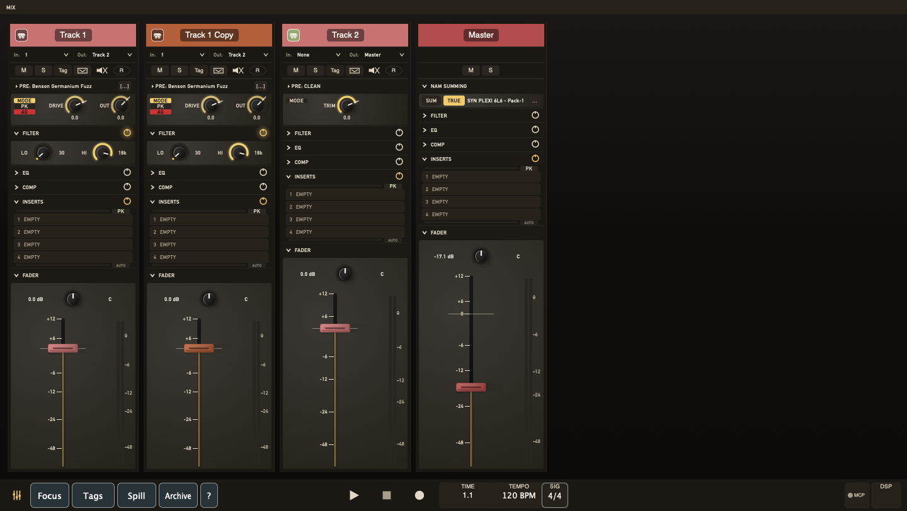

# The Mixer

Press **M** to switch between the timeline and mixer views. Press
**Cmd+Shift+M** to pop the mixer into or out of its own window. Press
**Cmd+M** to toggle Tape Mode on the visible mixer; if the mixer is hidden,
TayPE opens the inline mixer while changing Tape Mode.

Mixer view, Tape Mode, the detached mixer window, the shared narrow/full-width
desk mode, and the shared section-collapse posture are app-global preferences.
If you leave TayPE with the mixer floated, Tape Mode on, the narrow desk
engaged, or shared sections folded, the next launch comes back that way.
On a first-run starter reel, TayPE seeds Tape Mode and the narrow mixer desk
only when those view preferences do not already exist. Each ordinary starter
track also has its first send routed to the Taype Rooms reverb bus with the
send level closed at -inf, so the return is ready without adding ambience
until you raise it.

The mixer shows one channel strip per track, laid out horizontally left
to right. The master bus is always the rightmost strip, and when the visible
rack fits inside the viewport it anchors flush to the far right as its own
lane. Adjacent bus strips keep a single visible seam between them inside a bus
run, while the wider bus gutters still mark the outside edges of the group.
Drag a strip's title panel sideways to reorder that track with the same
master-track and routing rules as arranger header reordering. A plain title
click selects on mouse-up, so holding and dragging the title panel does not
select the dragged strip first.
In the main mixer, the input/output routing row and mute/solo/control row sit
below the fader section, just above the track name. The docked arranger channel
strip keeps its routing and controls at the top.
Buttons, section headers, knobs, and the fader all follow the same live
interaction rules on every strip, including the master bus, even straight
after switching between arranger and mixer.
Comp buses add the same snap-blue group frame used in the arranger, with a
small +/- square in the top-left corner so you can collapse or expand the
visible child take strips without changing any routing. That folded state is
saved with the reel, so reopening the session restores the same comp-group
desk shape.
Scroll horizontally with the mouse wheel or trackpad to navigate across your
channels.

## Tape Mode

The reel glyph beside the mixer-width button switches the visible mixer into
Tape Mode. Tape Mode replaces the upper processing lane with animated tape
reels and keeps the normal fader rack underneath for the track strips. If
neither the inline mixer nor the detached mixer window is showing, Tape Mode
opens the inline mixer while it changes state. The master bus stays pinned at
the right as a full output strip, so the reel deck and ribbon stop before the
master lane instead of covering the output bus. The arranger channel strip is
unchanged.

When the transport plays, both reels spin anti-clockwise. The left reel loses
tape and the right reel gains it against a physical 456 tape capacity: 2500 ft
at 15 ips, or 2000 seconds. After that visual tape length, the left reel stays
at its minimum tape pack and the right reel stays full instead of wrapping or
extrapolating. The reels derive their rotation from constant linear tape speed:
the supply reel accelerates as it empties and the take-up reel slows as it
fills. The animation does not change audio routing or processing.

If the Cut has markers, Tape Mode shows marker pills down the left side of the
tape deck in time order. The first row is reserved for **+**, **L**, and
**R**: **+** adds or removes a marker at the playhead, **L** jumps to the left loop brace,
and **R** jumps to the right loop brace. **Cmd-click L** sets the left brace at
the playhead; **Cmd-click R** sets the right brace there. **+** still drops a
marker during recording, while marker-pill jumps are blocked until recording
stops. If the left stack
fills, later markers continue down the far right side of the deck. Marker names
are shortened to 16 characters on the pills.

Below the deck, a narrow tape ribbon shows the selected tape length: 5, 10,
15, or 30 minutes from the View > Mixer > Tape Length menu. It defaults to 10 minutes
and always starts at absolute zero. Markers appear as coloured splice lines,
timeline 0 appears as a white splice when it has been moved away from absolute
zero, the playhead appears as a miniature playhead while it is within the
selected tape length, and the loop braces appear as small read-only brace
glyphs. Click the ribbon to seek to that point on the reel. If the song runs
beyond the selected tape length, the reel tape packs stay pinned at their end
state, the reel faces keep spinning, and the ribbon playhead disappears. During
recording, ribbon seeking is disabled.

## Channel Strip Layout

Each strip shows (top to bottom):

- **Track name** - double-click to rename
- **Input selector** - which audio interface input the track records from
- **Control buttons** - M (mute), S (solo), R (record arm), MON (software
  monitoring), A (archive), B (bus). The master strip swaps the normal solo
  toggle for a yellow `S`-with-`X` **Cancel Solo** button that clears every
  current solo state in one click and stays disabled when nothing is soloed.
  `Cmd-click` on a normal S button clears other explicit solos first, then
  solos that strip.
- **Route-aware solo** - solo follows the live signal path: soloing a bus
  keeps its active upstream feeders, and soloing a track or bus keeps its
  active downstream bus/send path alive. `MON`-off bus ingress and dead sends
  stay out of the solo path. Tracks and buses that are only riding that solo
  path show a softer yellow solo lamp instead of the full hard-solo state.
  Click a dim inherited solo lamp to drop that strip out of the current solo
  group, and click it again to let it back into the inherited path.
- **Output selector** - where the track sends its audio, with a destination
  track tint that keeps the routed hue clean against the dark strip
- **Preamp section** - MODE/AG/SAFE controls with always-visible Trim and
  mode-dependent Drive or NAM Output Gain
- **Filter section** - high-pass and low-pass filters with a spectrum button for the shared EQ Visualiser window
- **EQ section** - 3-band parametric equaliser with the same shared EQ Visualiser button
- **Compressor section** - dynamics processing
- **Insert slots** - up to 8 slots for VST3 plugins, with per-slot power buttons, a hover latency readout that stays clear of that switch, and clear drag/drop ghost + target cues while you reorder or copy inserts, including the empty-top-slot drop shortcut
- **Sends section** - bus sends with a `POST` / `PRE` mode switch, a section power button, and live RMS hint rings
- **Pan knob** - stereo position
- **Fader** - volume, with dB readout
- **Peak meter** - stereo level meter with clip indicator
  (display updates at 4 Hz and keeps transient peaks per update window)

Each processing section can be expanded or collapsed with its header
toggle. See the [Channel Strip](channel-strip/README.md) page for details on
every section. That shared lane posture is global to the app across the
docked strip, inline mixer, and floated mixer, so if you leave a shared
section folded TayPE brings every desk surface back that way on next launch.

Right-click any section header to load a preset for just that section or use
**Save Section As...** at the top of the menu to save into that section's
folder under `Documents/Taype/Presets/Channel Strip Section`. If the strip
section already came from a preset, TayPE pre-fills that preset name in the
save dialog so you can rename or overwrite it without typing from scratch. If
the preset name contains `/`, TayPE stores it in nested folders under that
section's preset root, and the popup menu mirrors that folder tree as nested
submenus. Section headers show a preset-name pill only when that section still
matches the active strip preset's `CSP/...` path, or when no strip preset is
active at all. Older libraries saved in the previous section-preset folder
still load.

Right-click the strip title bar to load or save a full channel strip preset.
Those live under `Documents/Taype/Presets/Channel Strip`. Each strip preset
stores the fader panel state directly and recalls the rest of the strip through
section presets under `Documents/Taype/Presets/Channel Strip Section/<Section Name>/CSP/<Preset Name>`.
The strip file also carries the full `INSERTS` rack state inline, so loading a
strip preset brings the saved plug-in chunks back with it instead of relying on
whatever state those plug-ins happen to be in now.
Use **Save Strip As...** at the top of that menu when you want to save a whole
strip preset from the title bar.
If the strip preset name contains `/`, TayPE mirrors that path in both places,
and the popup menu mirrors that folder tree as nested submenus too. Older
libraries saved in the previous strip-preset folder still load.
If you change a recalled section afterwards, its preset pill grows a `*` so the
strip stops pretending it is still on the saved preset state. TayPE also shows
that `*` if the backing preset file has gone missing. If a recalled insert
plug-in is not installed on this machine, TayPE skips that slot and warns you
instead of aborting the whole strip load.

The mixer keeps an empty strip column before the master lane. Its square plus
button sits where the fader would be; click it to add a new audio track without
leaving the mixer.

The `PREAMP` header now stays a clean section label. Its mode/profile line sits
inside the section body above the preamp mini meters, with the NAM browse
button living on that row instead of in the header.
If a track already remembers a NAM profile but the live NAM engine has dropped
out, switching back to **NAM** while stopped reloads that remembered profile
instead of leaving the strip silently passing clean audio.

Section presets only recall what belongs to that section. Fader presets bring
back volume, pan, strip mode, and polarity, but they do not change the track's
hardware input or output routing. Send presets try to reconnect by bus ID or
bus name; if a target bus is missing in the current reel, TayPE skips that send
and tells you. Insert presets and strip presets both warn and carry on if a
saved plug-in cannot be restored.

## Using the Controls

**Faders and knobs** - click and drag vertically. Each drag is a single
undoable action.

Send level knobs are safe to move while the transport is running. Changing
track input/output routing, the main output route, or a send target is also
playback-live now: TayPE may briefly fade or skip audio while it swaps the
routing graph, but the playback clock keeps moving.
The `SENDS` header mode button flips the whole strip between `POST` and `PRE`.
`POST` follows the fader; `PRE` keeps the send alive with the fader down. The
new SENDS power button sits to the right of that mode switch and bypasses send
processing without changing the stored send routes. When it is off, the send
feed and the thin RMS ring both go quiet. The thin ring around each send knob
is an RMS-only hint of what is actually feeding that send.

The EQ header's spectrum button opens the one shared floating **EQ Visualiser**
window for that track. Open it from another strip and TayPE retargets the same
window instead of opening a second one, and while it stays open it follows the
currently selected track automatically.

**Buttons** (mute, solo, etc.) - single click to toggle.

Turning **B** on makes the track a bus and switches its input to no device
input. Turning **B** off disconnects any tracks routed to that bus so your
routing stays valid.

**Cmd-click** the same bus glyph to enter comp mode. A comp bus does not add
new engine routing underneath: it owns the group's visible input/record
controls while child takes remain ordinary tracks routed to that bus.

**Insert slots** - click an empty slot to load a plugin. Each loaded row now
has its own power button: click it to bypass that slot, or **Option-click** to
disable / re-enable it. That disable toggle also clears the slot's own bypass
latch, so it comes back live when you re-enable it. Drag a loaded slot to move
it within that chain or to a
different strip; **Cmd-drag** copies instead. Drop on a slot to replace it, or
drop between rows to insert and shift later slots down. If playback is already
running, insert picking stays available and TayPE swaps the graph without
stopping the clock.
If the loaded plug-in name clips, hovering that row reveals the full plug-in
name with its latency on a second line, even with Popup Help turned off.

**Track name** - single-click the title panel to select that track in the
arranger and light its footer outline. **Cmd-click** toggles visible strips
into or out of the mixer selection, including deselecting the last selected
strip, **Shift-click** extends the selection as a visible range, and **Cmd+A**
selects every visible strip. Arranger track headers share the same
**Cmd-click** / **Shift-click** multiselect behaviour, but arranger **Cmd+A**
still belongs to clip selection and **Cmd+Shift+A** selects every clip on the
currently selected tracks. When more than one track is selected, the arranger
strip stays pinned to the first selected track, and opening or updating the
mixer scrolls to the first selected visible strip in mixer order so the active
group stays in view. Grouped mixer edits
apply to the visible selected set only, and grouped fader / pan / width drags
preserve each strip's relative offset instead of snapping everything to one
flat line. If a linked control hits its min/max rail, it stays pinned there
until the drag comes back far enough for the original offset to fit again.
Double-click the name pill to edit inline (only
when transport is stopped). During playback, live fader, pan, width, and
preamp level moves glide over a short internal ramp so what you hear and print
stays clean instead of stepping at block edges. Return commits; Escape or
clicking away cancels.

## Track Order

Tracks appear in the same order as the timeline. The master bus is always the
rightmost strip, and with spare width it parks flush against the mixer's right
edge as a dedicated lane. Horizontal scrolling moves the track rack only; the
master output lane remains visible.

Mixer visibility follows timeline view filters:

- **Archive View (X)** - shows active or archived tracks to match timeline mode
- **Focus (V)** - shows tracks with clips at the tape head position
- **Spill (G)** - shows the selected spill-capable bus or buses and tracks routed to them inside the current Focus/tag filter slice

The master strip stays visible through all of those filters, so the final sum
never drops out of the desk.
