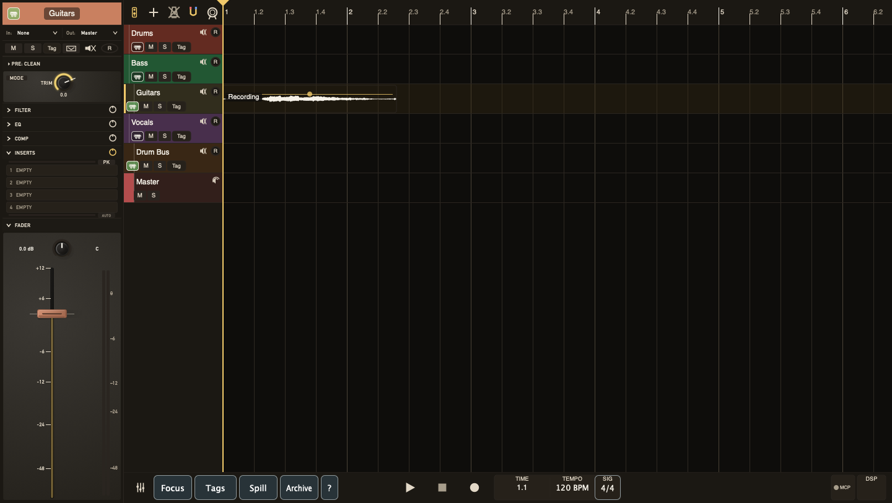

# The Timeline

The timeline is where you see your session laid out in time. Tracks run top to bottom, time runs left to right. The tape head — a vertical line — shows the current playback position.

## Layout

The left column shows **track headers** with controls. The main area shows **clips** — rectangles filled with waveforms representing your audio.

The **ruler** along the top shows time. Press **T** to toggle between minutes:seconds and bars|beats. Each Cut can define its own zero point, so the ruler and transport counter can read from a section start instead of absolute timeline start. In bars|beats mode, that zero point becomes bar `1.1`, and bars to the left read as negative.

The **transport bar** runs along the bottom. It has playback controls, a draggable BPM readout, and position readout in the middle, then a Cut actions menu for **New / Duplicate / Rename / Delete** and a Cut selector showing the active Cut name at the start of the right-hand utility cluster. The Cut actions menu sits immediately to the left of the selector. The left-side view buttons are: **Show Mixer**, **Focus**, **Tags**, **Spill**, **Archive**. The **?** popup-help toggle lives at the far right of the transport bar.

The transport **DSP** meter also overlays a numeric percentage, refreshed twice a second. Next to it there's a small **MCP** lock indicator. It lights red while an MCP transaction is active — right-click it to abort the lock.

With **Help → Popup Help** enabled, hover help appears after about **0.7 seconds** on ruler buttons, track-header controls, clips, fades, gain lines, and crossfade regions.

### Ruler Header Controls

The left side of the ruler has quick controls:

- **Channel Strip** — show/hide the channel strip side panel
- **+** — add a new track
- **Metronome** — toggle click on/off
- **Snap** — toggle grid snap
- **Ruler Mode** — switch between time and bars|beats

Right-click in the upper ruler area to open the zero-point menu:

- **Set 0 at Playhead** — make the current tape-head position the selected Cut's new `0:00`
- **Reset 0 to Start** — restore that Cut's zero point to the beginning

The lower ruler tick band keeps the existing right-drag pan/zoom gesture.
