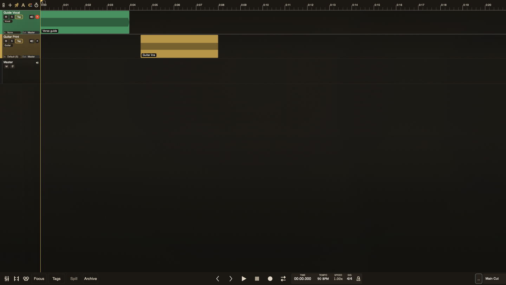

# The Timeline

The timeline is where you record, edit, navigate, and arrange the reel.

## Layout

The top ruler shows time or bars/beats. The tape head marks the current play position. Tracks run vertically down the left, with clips arranged on lanes to the right.

The selected track drives the docked channel strip, hardware-control focus, and many keyboard operations. TayPE keeps that selection visible when you change view, scale, or strip width.

## Ruler Header Controls

The ruler header includes controls for follow-playhead behaviour, mixer width, track creation, archive view, and other view tools. Follow keeps the playhead visible during playback without yanking your edit focus while you are making a deliberate selection or drag.

## Track States

A track can be current, focused, muted, soloed, record-armed, monitored, archived, or part of a bus/comp group. TayPE uses these states to keep busy reels readable: focus narrows attention, archive hides finished material, and grouped controls let selected tracks move together without flattening their relative balances.

## Editing Model

Most edits are non-destructive. Moving, splitting, trimming, fading, archiving, and disabling clips change the reel state without rewriting the original media. Splitting clips adds the current default fade at the new cut edges. Use checkpoints when you want a named recovery point before a bigger move.

## Related Timeline Workflows

* [Automation](automation.md): show, edit, and capture volume, pan, or width moves.
* [Varispeed](varispeed.md): rehearse or record at a different playback speed while preserving pitch.
* [Video Reference](video-reference.md): keep one picture reference in sync with the reel for scoring work.
