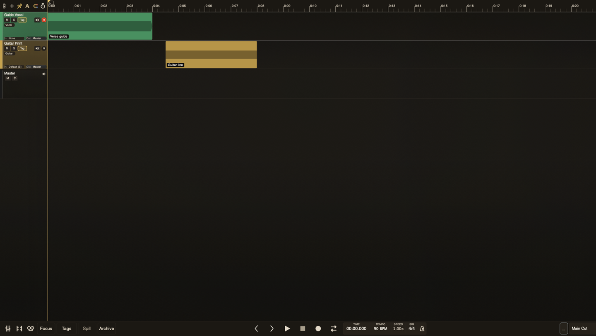

# The Timeline

The timeline is where you record, edit, navigate, and arrange the reel.

## Layout

The top ruler shows time or bars/beats. The tape head marks the current play position. Tracks run vertically down the left, with clips arranged on lanes to the right.

The arranger and transport have no right endpoint. You can seek, scroll, edit, record, or keep playing beyond the last clip; playback continues through silence until you press Stop or Pause. The horizontal scrollbar expands its working canvas as you move further right and is not an end-of-reel marker. The Tape Length selected for Tape Mode clamps only the reel and ribbon graphic, not the timeline or playback.

The transport position follows that ruler format. Its larger lower line shows the current time or bar and beat. Click the readout to toggle between the single display and a two-line display with the alternate value above it; TayPE remembers that choice globally. Double-click the larger value to type a new position in the format shown, then press Return to seek there. Escape or clicking away cancels the entry.

The selected track drives the docked channel strip, hardware-control focus, and many keyboard operations. TayPE keeps that selection visible when you change view, scale, or strip width.

## Ruler Header Controls

The ruler header includes controls for follow-playhead behaviour, mixer width, track creation, archive view, and other view tools. Follow keeps the playhead visible during playback without yanking your edit focus while you are making a deliberate selection or drag.

## Track States

A track can be current, focused, muted, soloed, record-armed, monitored, archived, or part of a bus/comp group. TayPE uses these states to keep busy reels readable: focus narrows attention, archive hides finished material, and grouped controls let selected tracks move together without flattening their relative balances.

## Editing Model

Most edits are non-destructive. Moving, splitting, trimming, fading, archiving, and disabling clips change the reel state without rewriting the original media. Splitting clips adds the current default fade at the new cut edges. Use checkpoints when you want a named recovery point before a bigger move.

## Where stem prints are saved

When **Stems** is selected, each print gets its own numbered folder in the
reel's print folder, and Print Marker Ranges makes one for each range. When
**Master** is selected too, the master sits at the top of that folder. A
stem print's `stems` folder holds the stems and their converted copies, and a
`reports` folder with the print's report, so you can drag the stems out of
Finder in one go. Each stem's file name still starts with the print folder's
name, so it says which print it came from, followed by a number, so Finder
lists the stems in the order they were printed: for example
`My Reel-Stems-v01-01-Bass.wav`, then `My Reel-Stems-v01-02-Keys.wav`. The
numbers start at 01 in each print folder. Stems printed together are numbered
in track order; a JD's Law or Seldon's Law print, which prints one stem at a
time, numbers them in the order it prints them. A Seldon's Law print also puts
The Mule in the `stems` folder, numbered after the last stem, and keeps each
stem as it was before matching in the `stems` folder's `raw` folder.

A track that isn't heard, because its output is **Off** or it goes into an
archived bus or a bus set to Off, isn't offered in **Choose Stems**. If you
chose it for an earlier print, TayPE keeps it in your choice but leaves it out
of the print: the Print Report names it, so the print reads **Completed with
issues**, and **Tools → Session Log** says why. If none of the stems you chose
is heard, the print doesn't start and TayPE tells you why.

## The Print Report

Every print saves a report when it ends, whatever ended it: it finished, it
failed, you cancelled it, or TayPE quit during it. Only a print that could not
start at all saves none; it shows a message saying why. The report has one
line for each file you asked for, named as it is in the print folder (for
example `stems/My Reel-Stems-v01-01-Bass.wav`), saying whether the file is
complete, and one plain line for each problem on the way. A stem print's report
goes in its `stems` folder's `reports` folder; any other print's report goes
beside its file, with the same name ending `.print-report.txt`. A print started
over MCP saves its report too, but opens no window.

When a print ends, Finder shows what it wrote, whether it finished, failed or
was cancelled.

The report starts with the print's status:

* **Completed**: every file is complete and nothing went wrong. TayPE shows
  nothing beyond the files in Finder.
* **Completed with issues**: every file is complete, but something affected
  the audio, such as a stopped plug-in the print played without, a plug-in or
  NAM preamp that fell behind, NAM Quality that could not be used for an
  Offline print, an automation lane an Offline print could not play, the disk
  not keeping up with a Live print, or TayPE not being able to return to
  realtime processing after an Offline print. A Seldon's Law print also reads
  this when its stems and The Mule do not add back up to the master within
  its target, or when it could not delete its working files.
* **Failed**: a file or a converted copy you asked for is missing or
  incomplete, or part of a batch was never printed. A Seldon's Law print also
  fails when it could not match a set of stems to the master; the report
  says why.
* **Cancelled**: you cancelled the print, you pressed Stop during an Offline
  print (while Seldon's Law matches its stems too) or during a Live Print
  Marker Ranges or JD's Law print, or TayPE quit during it.

Every complete WAV is converted to the FLAC, AAC or MP3 copies you asked for,
even when the print failed or was cancelled, and each copy is listed under its
WAV. A WAV that was cut short is not converted. If a copy cannot be made, its
WAV stays beside it and the report says so. When TayPE quits during a print,
nothing is converted. When it quits while copies are being made, the copy in
progress is deleted, the WAV stays, and the report says which copies were not
made.

A print keeps every file it wrote, whatever ended it. A WAV that was cut short
stays where it was written, and the report lists it as incomplete. A file that
got no audio at all is deleted, and the report lists it as not created; a Live
print stopped before any audio reached it prints nothing and says the print
failed. A file of silence that runs its full length is complete: TayPE judges a
file by its length, never by what is in it. If an MP3, M4A or FLAC copy cannot
be finished, the unfinished copy is deleted and its WAV stays beside it.

When a print does not read **Completed**, the **Print Report** window opens
and shows the report, once any converted copies are made. A Live print that
failed shows a message instead, naming the print that failed and pointing you to **Tools → Session Log**, and a print TayPE quit during opens nothing. **Copy** copies it, and **Reveal File** shows the saved
report in Finder. Press Escape or close the window when you have read it.
**Tools → Session Log** has the details behind each line. If the report itself
cannot be saved, the window says so.

## Printing wet stems with JD's Law

In the Print Mix, Print Loop, or Print Marker Ranges export window, select
**Stems**, choose the tracks or buses you want, then enable **JD's Law**. TayPE
prints each selected stem through its downstream buses and the master, one at
a time. This includes the downstream mix processing rather than only the
direct post-fader stem. A selected bus includes its contributing tracks and
their sends to shared effects returns. Those returns process only sound from
that bus's pass, not other tracks feeding the same return. A track that keys a
plug-in's sidechain still keys it when the track is not in the stem, is muted,
or goes into a muted bus or a bus with MON off; its own sound stays out of the
stem.

In **Choose Stems**, **Select All Shown** selects every target in the current
filter. Once all shown targets are selected, the button becomes **Deselect All
Shown**. Changing filters does not clear selections hidden by the new filter.

The export window hides any visible plug-in windows before it opens. When it
closes, TayPE restores those plug-in windows in their previous order. Plug-ins
that were already hidden with Option+P remain hidden.

Muted targets remain muted. If **Master** is also selected, TayPE prints the
ordinary full mix once and then prints the wet stems. Live mode plays every
pass in real time; Offline mode performs the same sequence without sending it
to the speakers. Any solo state that existed before printing is restored when
the operation finishes or is cancelled. If a JD's Law print fails, is
cancelled, is stopped, or TayPE quits during it, the files its passes already
wrote stay in its print folder.
In Live mode each pass starts only once the previous pass has fully stopped.
If a pass cannot start, for example because Playback is refused, its file
cannot be opened, or JD's Law cannot isolate its stem, TayPE names it and the
reason in the Print Report and carries on with the next one. With Print Marker
Ranges, a range whose folder cannot be made is named and skipped, and the
other ranges still print. Because a pass was not printed, the print reads
**Failed**. Pressing Stop during a Live JD's Law print keeps the pass you
stopped and ends the print as **Cancelled**.
If an Offline pass finishes but TayPE cannot return to realtime processing
afterwards, it keeps the completed files, converts them, and stops the
remaining passes; the Print Report names what could not be put back.

## Printing stems that add up to the master with Seldon's Law

JD's Law prints each stem through the master on its own, so each stem gets
only the master processing it caused by itself. In the full mix, the master's
compressor and limiter react to everything at once. Seldon's Law measures what
the whole mix did to each stem in the master and puts that into the stem, so
the stems keep the master's sound and, played together with The Mule, add back
up to the master.

In the Print Mix, Print Loop or Print Marker Ranges export window, choose
**Offline** and **Stems**, then enable **Seldon's Law**. It starts off each
time the window opens and turns off if you switch to **Live**. You can use
JD's Law or Seldon's Law, not both: enabling one turns the other off.

Seldon's Law chooses the stems from your routing. Every track or bus that
goes to the master with clips playing through it is one stem; tracks routed
into a bus are part of that bus's stem. A bus that only takes sends, such as a
reverb or delay return, is not a stem of its own: each stem includes its share
of it. A muted bus, and the tracks going into it, play no part, and a bus with
MON off counts only by its own clips. **Choose Stems** shows the stems
Seldon's Law will print, but you cannot change them while it is on. Turn it
off to choose your own; your own choice is still there.

Some routing cannot be split into stems this way. The export window then says
why, names the tracks and buses, and **Export** stays unavailable:

* a bus going to the master that takes sends and also has tracks routed into
  it or clips of its own;
* a bus inside a group bus that takes sends from tracks outside that group;
* a muted master, or nothing reaching the master;
* a track that reaches the master but belongs to no stem.

TayPE prints the master first, then each stem, then matches the stems to the
master. While it matches, the banner says "Seldon's Law: matching the stems to
the master" with its progress. Until it has finished, TayPE doesn't play or
record. Pressing Stop cancels the print: the stems it has already matched, and the master if you selected
**Master**, are still saved, and the print reads **Cancelled**. If a pass
cannot be printed, TayPE names it in the Print Report and prints the others;
the stems that pass belongs with cannot be matched, so the print reads
**Failed**.

In the `stems` folder you get:

* the matched stems, and **The Mule**, numbered after the last stem (for
  example `…-03-themule.wav` after two stems): whatever no stem can own,
  normally silent. Keep it with the stems, because the stems add back up
  to the master only with it. These are saved as 24-bit WAVs and converted to
  the formats you chose.
* a `raw` folder with each stem as it was before matching, its raw stem,
  named after the stem with `-raw` added (for example `…-01-Bass-raw.wav`).
  These are 32-bit float WAVs. They are always kept as WAVs and never
  converted, and the Print Report lists them under "Raw stems before Seldon's
  Law (kept as WAV)".

The master is always printed, because the matching needs it, but it is kept
only when **Master** is selected. TayPE keeps its working files in a hidden
`.seldon-work` folder in the print folder and deletes it when the print ends.
If it cannot, the Print Report names the folder, which you can delete
yourself, and the print reads **Completed with issues**. The Print Report also
says when the stems and The Mule do not add back up to the master within the
-100 dBFS target.

## Offline plugin oversampling

Select **Offline** in the Print Mix, Print Loop or Print Marker Ranges export
window to show **use 4x plugin oversampling**. This optional setting processes
each uninterrupted audio-effect plugin section at 192 kHz, then returns its
audio to TayPE’s 48 kHz engine. It also applies to offline stems and JD’s Law
passes. MIDI-capable audio effects are included; instruments, hardware handling
and ToTaype’s built-in processing remain unchanged. The output file’s sample
rate does not change.

TayPE remembers this choice globally, including when you cancel the dialog.
The checkbox is hidden in Live mode. It has no effect on realtime prints,
playback or tracking. Oversampling can reduce aliasing from nonlinear plugins;
its extra processing cost applies only while printing offline.

## Plugin oversampling for bounce

**Preferences → General → use 4x plugin oversampling for bounce** enables
192 kHz processing around each uninterrupted audio-effect plugin section
during **Bounce Clips to Stem** and **Bounce Tracks to Stem**. It uses the
same 4x plugin oversampling as offline Print; the bounced file stays at 48 kHz.

The choice is saved globally, separately from the Print dialog setting, and
defaults to off. It does not affect synth rendering, comp flatten, Bounce
External, playback or tracking.

## When a Live print cannot start

If a Live print cannot start, nothing is printed and TayPE shows one message
saying why: the print folder could not be created, Playback could not start,
or the print pass could not start. If one pass of a Live Print Marker Ranges
or JD's Law print cannot start, TayPE names it and the same reason in the
Print Report and goes on with the next pass. A Live print with stems opens every stem's file before it
plays, so if one stem's file cannot be opened, nothing is printed.
**Tools → Session Log** gives the reason. It names the stem's file and its
track, or the folder that could not be created and why.

## While an Offline print runs

From an Offline print's first pass until it ends, including while Seldon's Law
matches the stems, TayPE doesn't play or record. If you press Play or Record,
on the transport, with the keyboard or over MCP, the transport says so and the
print carries on. Press Stop to cancel the print. While a pass is printing,
the transport shows it playing, so Space, which plays and stops, stops it and
cancels the print as Stop does. Only a Live print plays.

## When an Offline print cannot write a file

An Offline print writes each of its files on its own. If one file cannot be
opened, or the disk takes none of its audio for 30 seconds, TayPE stops writing
that file and prints the others to the end. The Print Report lists that file as
not created or incomplete, so the print reads **Failed**, and **Tools → Session
Log** names the file and why. The print stops early only when none of its files
can be written. Whatever ends an Offline print, the files it wrote stay where
they were written, incomplete ones included. **Bounce Clips to Stem**, **Bounce Tracks to Stem** and
flattening a comp bus still fail if their file cannot be written, and change
nothing in the reel.

## Stopped plug-ins in prints and bounces

A plug-in that is stopped until it is reloaded shows red in its insert slot;
[Insert Slots](../channel-strip/inserts.md) explains why and how to clear it.
Print Mix, Print Loop and Print Marker Ranges still print through it, in Live
and Offline mode, including stems and JD's Law: a stopped effect passes its
input through in its place, and automation aimed at it is not applied. When the
print completes, it reads **Completed with issues** and the Print Report names
each stopped plug-in with its track, as **Tools → Session Log** does. An
Offline print also logs
each automation lane that could not reach a stopped plug-in, once per pass,
and carries on.

**Bounce Clips to Stem**, **Bounce Tracks to Stem** and flattening a comp bus
replace audio in the reel, so they fail rather than keep a render that skipped
a stopped plug-in in their signal. TayPE names the plug-in, or how many there
were, changes nothing in the reel, and asks you to reload or remove it, then
try again. Only plug-ins the bounced audio passes through count: a stopped
plug-in on the Master does not stop a stem bounce, and one on a comp bus itself
does not stop flattening it, because both are taken before those plug-ins.

**Bounce External** leaves the reel unchanged, so it plays on like a print: it
writes the file with the stopped effect's input in its place, then shows one
warning naming the plug-in, or how many there were, and **Tools → Session Log**
names each one.

## Bouncing tracks that aren't heard

A track isn't heard when its output is **Off**, or it goes into an archived bus
or a bus set to Off. **Bounce Clips to Stem** and **Bounce External** won't
bounce clips on such a track: TayPE names the track (or says how many, with
each named in **Tools → Session Log**) and changes nothing. **Bounce Tracks to
Stem** refuses the same way when none of the tracks you chose is heard, and
when nothing in them is heard because they are muted or empty it says "Nothing
in the chosen tracks is heard, so there is nothing to bounce."

## Plug-ins and NAM that fall behind in prints

An Offline print keeps playing when a plug-in or NAM falls behind. If a plug-in
does not finish a stretch of audio in time, that stretch is printed with the
plug-in's input in its place. If a plug-in stops responding, TayPE waits 30
seconds, then prints the rest without it and without the plug-ins that share
its processing lane. The Print Report says which plug-in stopped responding,
and names each plug-in that was left out only because it shares that lane. A
plug-in that is not available, for example because the plug-in sandbox
stopped, is printed with its input in its place, and the Print Report names
it. A
preamp or summing stage that stops responding (NAM, Modern, ToTaype or MD510)
is let go the same way, and the tracks it runs are printed without that preamp
or summing from then on. The print still runs to its end, reads **Completed
with issues**, and the Print Report names each plug-in with its track and each
track printed without its preamp or summing, with the mode. **Tools → Session
Log** has the details.

If a preamp or summing stage TayPE let go is still busy when the print ends,
TayPE waits up to another 30 seconds for it before playback carries on. If it
never finishes, TayPE shows **Audio Engine Offline**, and playing, recording,
monitoring, printing, bouncing, edits and audio settings changes stay
unavailable until it does, each telling you why. The first of them you try
after it has finished brings playback back.

**Bounce Clips to Stem**, **Bounce Tracks to Stem** and flattening a comp bus
still fail when a plug-in falls behind, and change nothing in the reel.

Instruments never play during a print, Live or Offline, and never play into a
bounce or a comp flatten either. An instrument track's recorded clips print
and bounce as usual.

## Related Timeline Workflows

* [Automation](automation.md): show, edit, and capture volume, pan, or width moves.
* [Varispeed](varispeed.md): rehearse or record at a different playback speed while preserving pitch.
* [Video Reference](video-reference.md): keep one picture reference in sync with the reel for scoring work.

## Print tails

**Print tails** in the export window defaults to on. TayPE remembers the choice globally, even if you cancel. It applies to Print Mix, Print Loop and Print Marker Ranges, in Live and Offline mode, including master files, stems and JD’s Law.

Turn it off for an exact end with no added fade or tail: Mix stops at the last clip end, excluding archived tracks and tracks muted for the whole print (a muted track whose mute automation unmutes it counts); Loop stops at the right brace; Marker Ranges stop at each range end. Mix adds no extra second or extension to a later loop brace. Turning it on preserves the existing tail behaviour.
