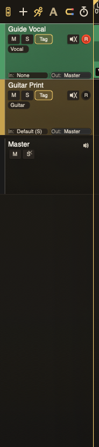

# Track Headers

Track headers hold the controls you need before reaching for the mixer.

## Controls

* **Name**: double-click to rename.
* **Mute / Solo**: silence or isolate tracks.
* **Tag**: apply and filter by track tags.
* **Archive**: move a finished track out of the main working set.
* **MON**: monitor input or instrument output.
* **Record**: arm the track for recording.
* **Input / Output**: choose routing.
* **Bus**: turn a track into a bus or comp group where supported.

The follow-playhead control lives in the timeline header toolbar, not inside each track header. It keeps playback visible while leaving selected-track focus alone.

## Selection

Click a header to select the track. Cmd-click toggles tracks into the visible selection. Shift-click extends a range. The first selected track remains the primary track for the docked strip and focused hardware control.

## Tag Cloud

The Tag popup lets you add labels such as `Vocal`, `Guitar`, `Print`, or your own categories. Tags help with filtering, selection, and keeping large reels sane.

## Archive View

Archived tracks are kept with the reel but hidden from the main working surface until Archive View is enabled. Use archive for printed stems, safety tracks, old takes, and anything you want preserved without cluttering the current pass.
